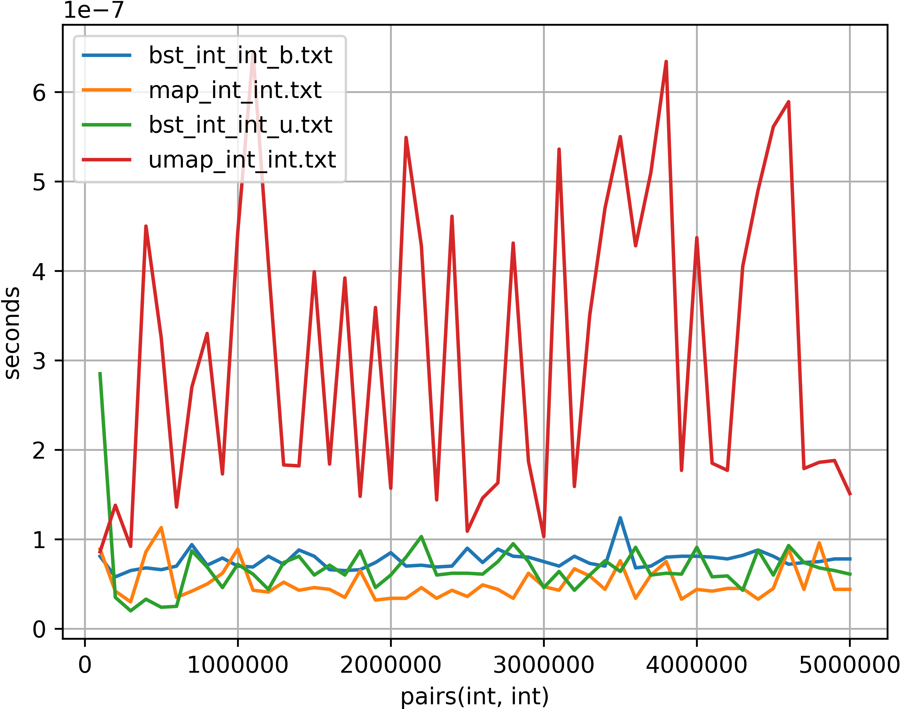
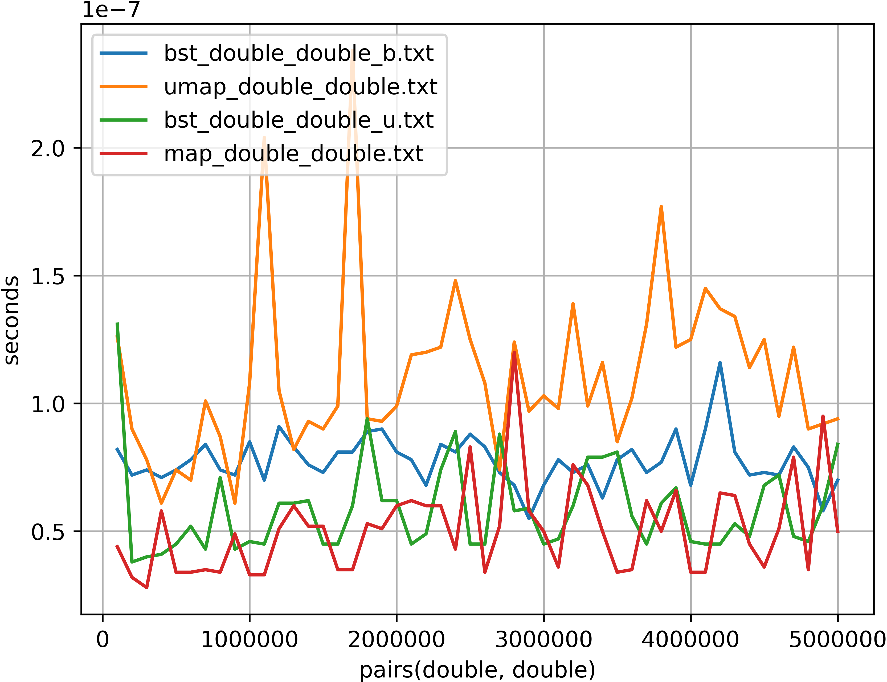

# pair(report.assets/int_int.png)pair(report.assets/int_int.png)Advanced Programming Exam Project: *Implementation of a template BST in modern C++*

Submitted by [Leonardo Arrighi](https://github.com/LeonardoArrighi), [Francesco Romor](https://github.com/FrancescoRo) and [Emanuele Ballarin](https://github.com/emaballarin).

## Introduction

The present report, submitted in fulfilment of the requirements for the *Advanced Programming exam* offered by [SISSA](https://sissa.it), describes and further documents (in addition to *Doxygen* documentation and additional code comments) the structure, main design choices, testing and benchmarking procedures and results of the design and implementation of a *Template Binary Search Tree* (BST) – complete with iterators –, developed in *modern C++* (i.e. C++ $\geq$ 11).

The whole project has been conceived to be compliant with *at least* the [specifications provided](https://github.com/asartori86/advanced_programming_2019-20/blob/master/exam/readme.pdf).

## Folder structure and execution steps

The Makefile is used to compile automatically our project in its various steps. To compile the documentation, the tests in the directory src and the benchmarks run the following command.

```
make
```

The `doc` folder includes the `doxy.in` used to generate the documentation. Run the following to generate the Doxygen documentation, it will be contained in the subfolders `html` and `latex`.

```
make docs
```

The include folder contains the implementation of the class binary search tree (``bst.hpp`), class node (`node.hpp`) and class tree_iterator (`iterator.hpp`). Some basic tests are performed in the folder `src` to compile run in the `src` directory.

```
make
```

The benchmarks folder contains the timings of the algorithm find implemented for our class bst and the std classes map and unordered map. The plots are saved in the directory bencharks/results along with the timings of the simulations for binary search tree, map and unordered map. To get the plots run the following in the results directory

```
python script.py
```


## Code structure and relevant design choices

The whole codebase – as well as the project development itself – has been organized into three main building blocks, which inter-operate in the global design of the template BST. Nominally: the *Binary Node*, the *Tree Iterator* (more precisely: an iterator over a structure of *binary nodes*) and the *Binary Search Tree* itself. The partition is due to avoid code bloating with type members of different template parameters.

As a general design rule, implementations have been initially concieved to be the most general possible – delaying eventual project-specific specializations or additions to the actual moment a different or more peculiar necessity emerged. As an example, this led to the creation of a *Binary Node* class, which is usable in both the case of a *tree composed of nodes* and that of a *generic structure composed of nodes*; likewise, the *Binary Node* class is capable of handling both generic data types – and `std::pair`s – as elements contained. In a similar fashion, the *Tree iterator* class is capable of iterating – with just minor modifications – over a generic graph composed of binary nodes.

Whenever possible, *generic programming* in the form of templating has been used in order to improve runtime performance, while also ensuring that the eventual user of such classes is able to access, through the same interface and without further modifications, any C++ data type as *key* or *value* stored in each node of the BST (or as *element of the node* more in general).

The RAII design pattern and abundant use of smart pointers improves memory safety in exception handling without dealing by hand deallocation.  In this perspective the class node is used as a resourse handle to manage the resourses in the tree class. The ownership of the children nodes is detained by the parent with unique pointers resulting in an asymmetric relationship.

The std header type-traits is used in the implementation of class tree_iterator and const tree_iterator to avoid code duplication. The type of the iterator is a forward iterator which follows the tree traverse order. 

In order to improve the runtime performance we used as much as possible one return per function, named return values (to trigger NRVO), forward references, inline keywards and implemented copy elision for the copy constructor of tree.

## Benchmarking

After obtaining a refined working implementation, further optimizations have been carried on together with testing, to ensure code correctness, and benchmarking, to assess the performance of the final result both in a *balanced* and an *unbalanced* tree situation, and its comparison with the already existing data structures `std::map` and `std::unordered_map`, both based on self-balancing trees.





Results show that, if supported by adequate compiler optimizations, the final implementation is at least equally performing w.r.t. Intel-optimized `std::map` both in the balanced and the unbalanced case, and consistently better-performing w.r.t. GCC `std::unbalanced_map` (being an Intel-optimized version unavailable).